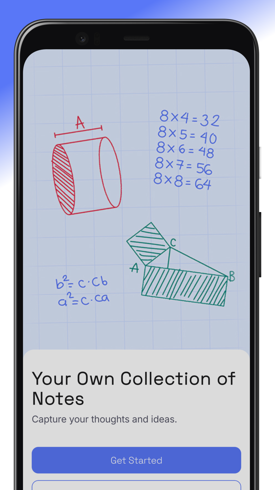
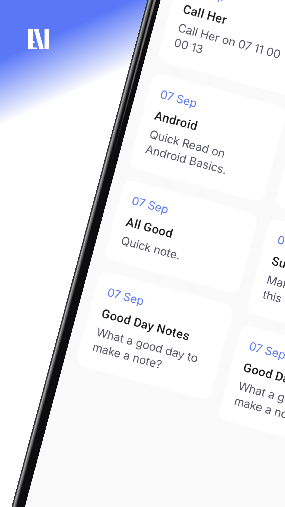
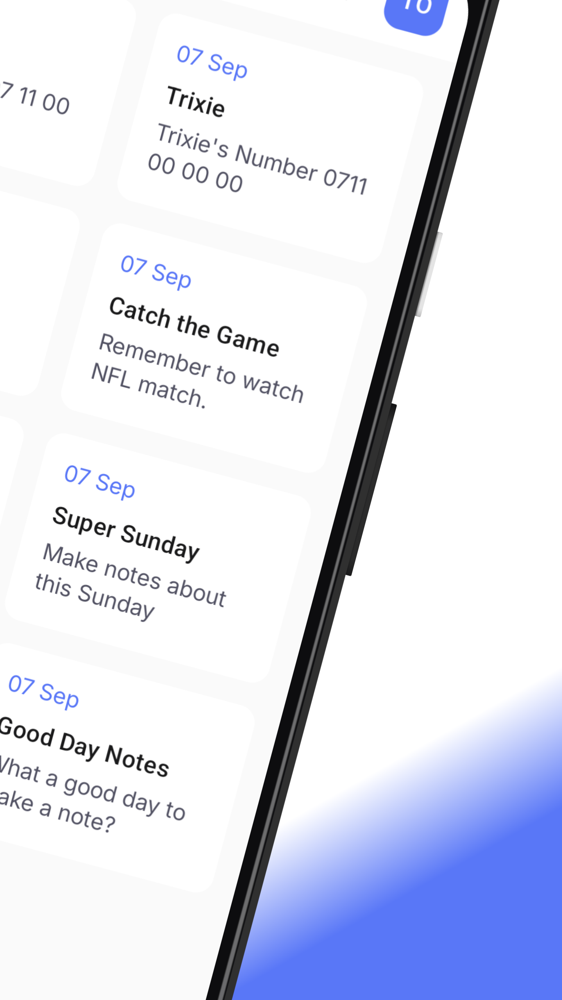

<div align="center">
  <a href="#">
    
  </a>

<h1 align="center">
<b><i>NoteMark</i></b>
</h1>

<p align="center">
  
  
  
</p>

<p align="center">
  Offline-first Note Taking App with Background Sync ✨
  <br />
  <a href="#-screenshots">Screenshots</a> •
  <a href="#-features">Features</a> •
  <a href="#-tech-stack">Tech Stack</a> •
  <a href="#-getting-started">Getting Started</a> •
  <a href="#️-authors">Authors</a> •
  <a href="#-contributing">Contributing</a>
</p>
</div>

---

Android app for creating, editing, and syncing notes with **offline-first support**.  


<p align="center">
  <!-- Google Play badge -->
  <a href="https://play.google.com/store/apps/details?id=com.tonyxlab.notemark" target="_blank">
    
  </a>
</p>
<p align="center">
  <!-- Demo GIF -->
  
</p>

---

## 📸 Screenshots

<p align="center">
 &nbsp;&nbsp;&nbsp;
 &nbsp;&nbsp;&nbsp;
 
</p>

---

## 📱 Features

- ✍️ Create, edit, and delete notes  
- 🔄 Offline-first architecture with **background sync**  
- 🕑 Auto-save while typing  
- ☁️ Conflict resolution with **Last-Write-Wins** strategy  
- 🎨 Clean UI powered by Jetpack Compose  

---

## 🚀 Tech Stack

- Kotlin  
- Jetpack Compose  
- JWT (JSON Web Token) authentication
- Room Database + DataStore  
- WorkManager for background sync  
- Ktor for API communication  
- Dagger Hilt for Dependency Injection  
- Coroutines & Flow for async work  

---

## 🧰 Getting Started

### Prerequisites
- Android Studio Narwhal or Later 
- Android device or emulator running Android 6.0 (Marshmallow) or higher  

### Installation
1. Clone the repository:
   ```sh
   git clone https://github.com/Tonnie-Dev/NoteMark.git


## 🖋️ Author

**Tonnie** – [@Tonnie-Dev](https://github.com/Tonnie-Dev)

<p align="left">
 <a href="https://www.buymeacoffee.com/AgVrgB4N3r" target="_blank">
    
  </a>
  <a href="https://www.linkedin.com/in/antony-muchiri/" target="_blank">
    
  </a>
  <a href="https://twitter.com/Tonnie_Dev" target="_blank">
    
  </a>
</p>


## 🛂 Contributing

Contributions Echo Journal are welcome and appreciated! Whether it's a bug fix, new feature, improvement, or even a typo correction – you're more than welcome to jump in 🚀

If you are interested in seeing a particular feature implemented in this app, please open a new issue after which you can make a PR!

### 📜 License

This project is licensed under the [MIT License](./readme-assets/LICENSE).
